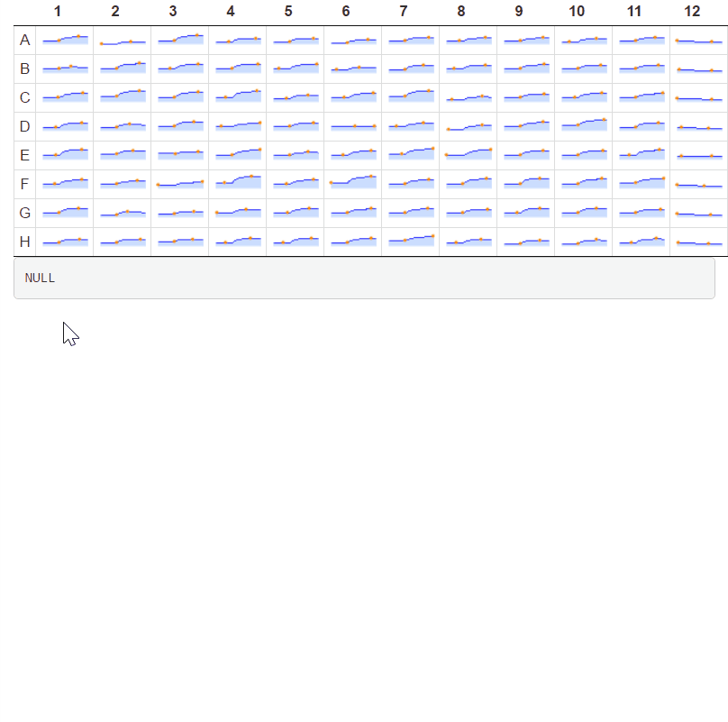

# sparklinePlateMod
A shiny module for plotting microplate data as sparklines

### Introduction

This is a `DT` package based shiny module that can plot microplate assay data (e.g., FLIPR assay) as sparklines and return infomation of user selected wells.


### Pre-request

This shiny module requires following packages. Please make sure they are installed.

```r
install.package('dplyr')
install.package('tidyr')
install.package('DT')
devtools::install_github('htmlwidgets/sparkline')
```

### Usage

1. Source the module file

  ```r
  source('sparklinePlateMod.R')
  ```
  
2. In server function, create a shiny reactive object that contains the microplate data to be displayed in dataframe format: 

  ```r
  server <- function(input, output) {

    # The microplate dataframe could contain three columns:
    #   Well(chr): the well id of microplate (eg, A1, A2, B5, D12) 
    #   X(num, optional): the value to be plot on x axis of sparklines, if missing, will be generated automatically
    #   Y(num): the value to be plot on y axis of sparklines
    # The dataframe may contain other columns and will be ignored.
    
    microplate <- reactive({
      readRDS('demo_data.RDS')
    })
  
    # other codes

  }
  ```

3. Invoke module in server function and send the microplate data object to the `data` parameter. Set `nrow` and `ncol` to define the type of microplate:

  ```r
  selected <- callModule(slplate, id = 'YOU_MODULE_ID', data = microplate, nrow = 8, ncol = 12)
  ```

4. Add layout output ui

  ```r
  ui <- fluidPage(

    slplateUI('YOU_MODULE_ID')

  )
  ```

5. Run app. Select wells by Ctrl/Shift + Click. The module returns a subsetted dataframe according to the selection.


